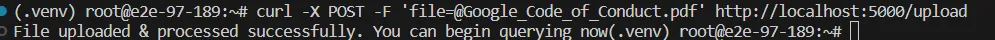
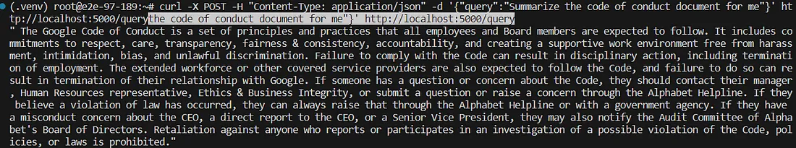

# Setup

1. Clone the Repo `https://github.com/JayyShah/Language-Models.git`
2. cd Customer_Service_assistant
3. `pip install -U -r requirements.txt`
4. Open Terminal and run `python app.py`

- You have a flask server (the chatbot) up and running on port 5000 of the localhost.
- To upload your pdf file, use the following command in a new terminal.

```bash

curl -X POST -F 'file=@/path/to/your/file.pdf' http://localhost:5000/upload

```

5. If the file is uploaded and processed, you should see the following message:



6. To send queries, use the following command:

```bash

curl -X POST -H "Content-Type: application/json" -d '{"query":"your query text here"}' http://localhost:5000/query

```

- Sample Query 

```bash

curl -X POST -H "Content-Type: application/json" -d '{"query":"Summarize the code of conduct document for me"}' http://localhost:5000/query

```




## Summary 

- In conclusion, the provided code sets up a Flask server to deploy a chatbot based on the RAG (Retrieval-Augmented Generation) pipeline. The server allows users to upload PDF documents, which are processed and split into chunks using LangChain. The text chunks are then embedded into a vector store using Hugging Face embeddings and indexed with Qdrant. The RAG pipeline, powered by the Llama 2 model, is utilized for text generation and retrieval. Users can interact with the chatbot by sending queries to the server, receiving responses based on the information stored in the vector store. The code demonstrates a comprehensive integration of various libraries and technologies to create a functional conversational AI system.